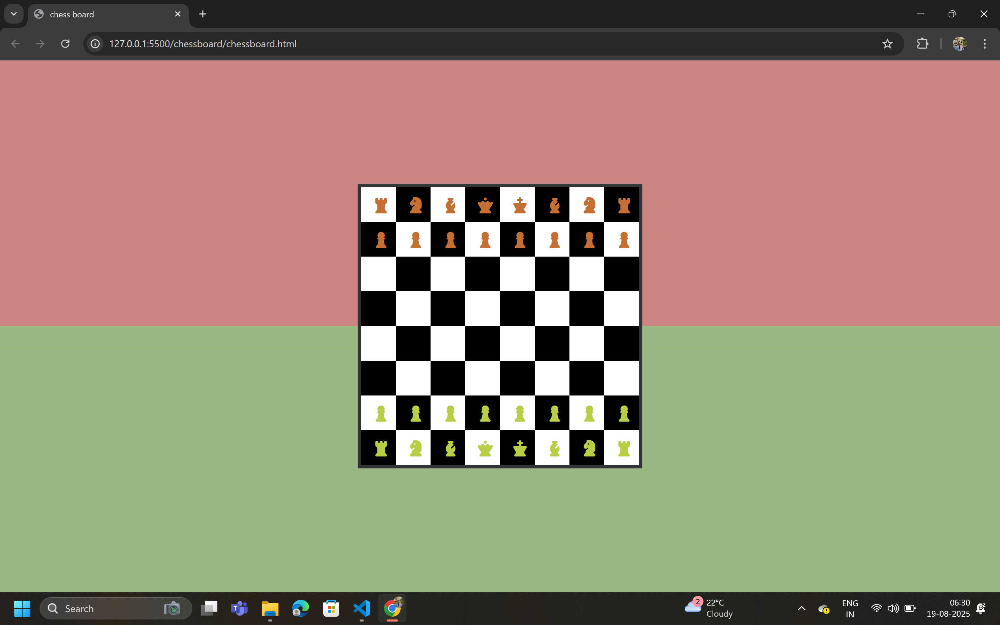

 # Chessboard Project 🎲

This project is a simple **chessboard layout** created as part of my class task using only **HTML** and **CSS**.  
It demonstrates the use of:

- **HTML tables / divs** for structuring the board  
- **CSS selectors & styling** for alternating black and white squares  
- **Basic layout concepts** such as width, height, and background colors  

