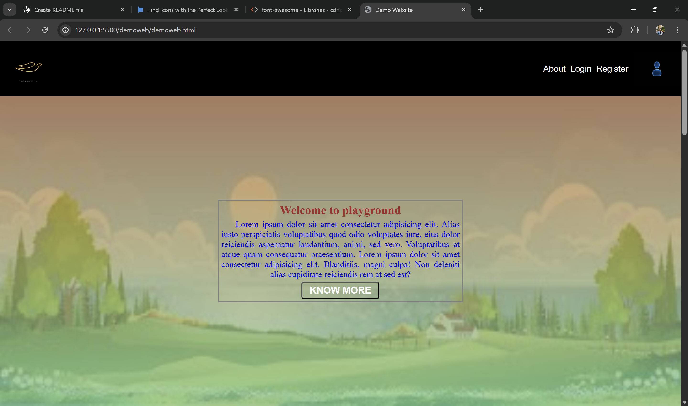

# Demo Web App (HTML & CSS)

This is a **basic demo web application** created as part of a **class task**.  
The project is built using only **HTML** and **CSS** to practice fundamentals of web development.

---

## 📌 Features
- Basic structure with HTML
- Styled layout with CSS
- Demonstrates use of tags, elements, and selectors

