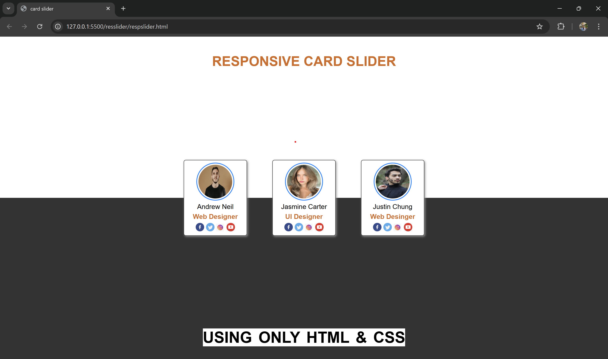

# Simple Profile Card 👤

This project is a **Profile Card UI** created as part of a class task using only **HTML and CSS**.  
It mainly demonstrates how to use **Flexbox** for layout and alignment.

## 🔹 Features
- Clean and minimal profile card design  
- Profile image, name, and description section  
- Social links or buttons (if added)  
- Centered layout using **flexbox**  

## 🔹 Technologies Used
- **HTML5** → structure of the profile card  
- **CSS3** → styling with Flexbox for alignment and spacing    

## 📷 Preview

